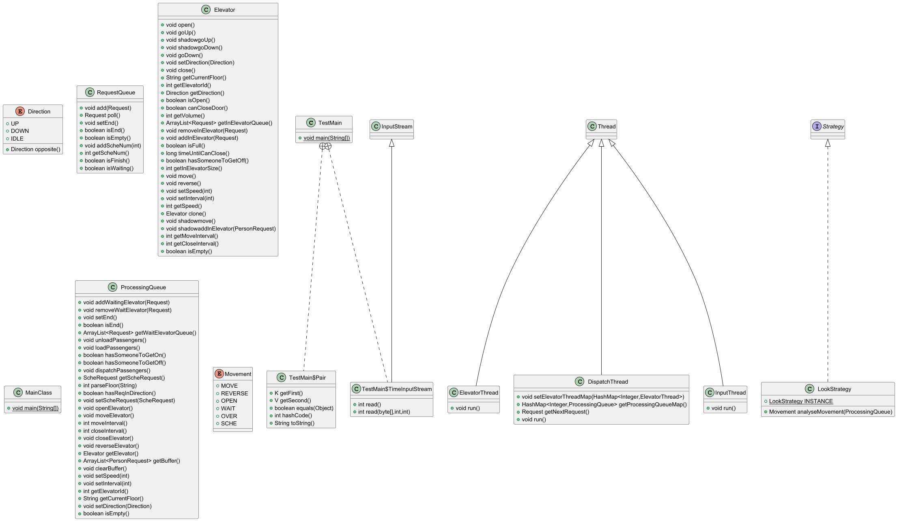
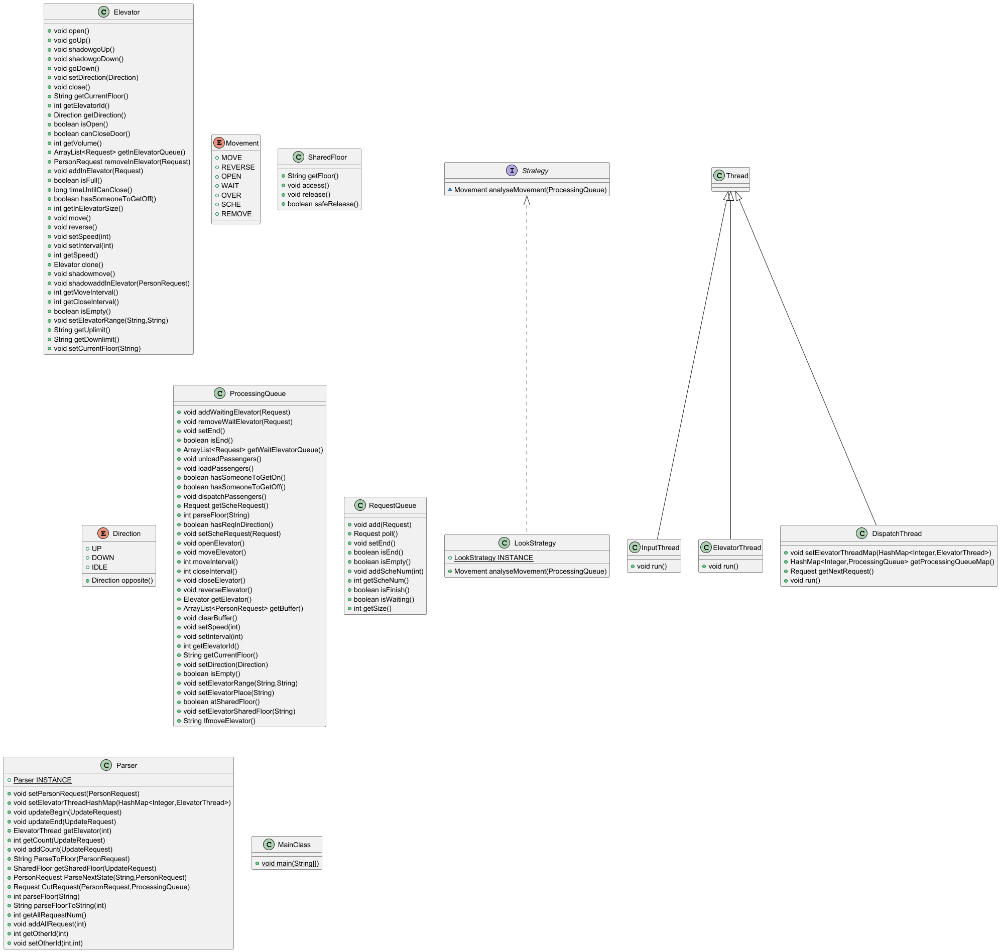

* 总结分析三次作业中同步块的设置和锁的选择，并分析锁与同步块中处理语句之间的关系
  
全部使用 synchronized 进行同步控制，主要有：

1. InputThread 和 DispatchThread 之间，要对 RequestQueue 进行同步控制。
2. DispatcherThread 与 ElevatorThread 之间，要对 ProcessingQueue 进行同步控制。
3. 两个电梯进程之间对sharedFloor的共享控制。

* 总结分析三次作业中的调度器设计，并分析调度器如何与程序中的线程进行交互；总结分析三次作业中的调度策略，并分析自己的调度策略是如何适应时间、电量等多个性能指标的

调度器专门用一个线程类来表示，从前面的队列中提出请求，通过调度策略分发给6个电梯进程中的一个。6个电梯进程在处理请求时可以向调度器发送回子请求，这些子请求再一次被调度器分发给6个电梯进程。

调度策略：原本的架构可以适应影子电梯，碍于实现时间过短，最后还是使用的随机分发。

值得一提的是：由于我考虑用影子电梯实现，调度并不需要特判，6个电梯想给谁就给谁。

* 识别出三次作业稳定的内容和易变的内容，并加以分析

易变的内容：对于电梯，它所面向的请求类型会发生变化，电梯本身的状态也会变，例如双箱电梯。

稳定的内容：多线程的生产者消费者模式是稳定的。不同线程之间通过共享对象进行联系，为了保证共享对象的线程安全性，则需要加锁以及同步方法进行处理。每个请求都需要：读入、调度、电梯处理。

* 分析自己在第三次作业中是如何实现双轿厢的同步开始改造和运行时两个轿厢不碰撞的

同步改造：我们引入一个Parser，两个线程清空自己的电梯后输入信号，信号量为2时Parser输出begin-end，改造只需要电梯修改自己的上下运行限制，并获得一个共享SharedFloor，这个共享量完成互斥访问即可。如果电梯线程要在特殊Floor里wait，会向反方向再移动一次离开。

* 分析自己程序出现过的bug以及自己面对多线程程序的debug方法

小bug没出，第二次作业进行了重构：

主要是要做到：线程和共享资源类之间的设计统一，要么只在线程wait/notify，要么只对资源wait/notify。

debug：使用IDEA的转储线程。或者printf大法。

* 结合线程协同的架构模式（如流水线架构），分析和总结自己三次作业架构设计的逐步变化和未来扩展能力画UML类图

第一次作业：
完成输入线程和调度器线程，以及调度器线程和电梯线程之间的生产者-消费者模型，实现数据流通路径。

第二次作业：

新增 RECEIVE 约束：乘客请求不再指定特定的电梯。
新增 SCHE 行为：乘客请求可以自动匹配到可用电梯。

我的架构变化：

注册 SCHE 操作，新增电梯相关运行逻辑，以处理 SCHE 行为。
修改电梯线程和调度器线程结束的条件，新增对特殊调度行为的计数。

第三次作业
第三次作业要求变化：

新增 UPDATE 行为：引入新的系统更新机制。
增加双轿厢协同：实现两层电梯的协同运行。
我的架构变化：

引入SharedFloor为共享资源，引入单例Parser来分割子请求。

第二次架构：

第三次架构：

首先输入->调度->电梯是一个常见的生产者消费者架构。

我们引入一个Parser，通过一个单例模式，把乘客请求当作一个产品，电梯作为工人，实现流水线架构，分割请求，依次完成。

电梯的调度策略是一个工厂模式，批量使用不同的策略，例如LOOK，只需要将电梯的所有行为用Movement列举即可运用不同策略。

未来扩展能力：可以实现更多类型的请求，电梯的内部数据也可以做很多设计。

* 从线程安全和层次化设计两个方面来梳理自己在本单元三次作业中获得的心得体会

线程安全的核心在于确保对于多线程共享的对象，其涉及的方法必须是原子性的，即要么全部执行，要么全部不执行。为了保证原子性，需要划分临界区，并通过同步块或加锁等机制来实现。

具体而言，当多个线程并发访问共享资源时，如果没有适当的同步机制，可能会导致数据不一致、竞态条件等问题。因此，通过同步块和加锁可以确保在同一时间只有一个线程能够修改这些共享资源，从而保证数据的一致性和正确性。

对于线程不安全的对象，可以通过管程的思想将其与相关的操作聚合在一起，形成一个新的对象，由这个新对象来保证线程安全。例如，可以使用synchronized关键字或者ReentrantLock等同步类来实现这一目标。通过这种方式，可以确保这些操作是原子性的，避免了竞态条件。

层次化设计对于实现线程安全至关重要。在设计多线程程序时，需要准确识别程序的流程步骤以及线程之间的交互模式，如生产者消费者模式。层次化设计能够帮助明确哪些对象是共享对象，哪些操作是需要同步的。通过这种区分，可以确保正确的同步和加锁，从而保障线程安全。
